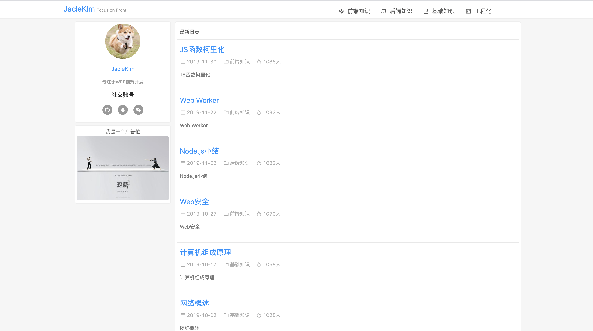
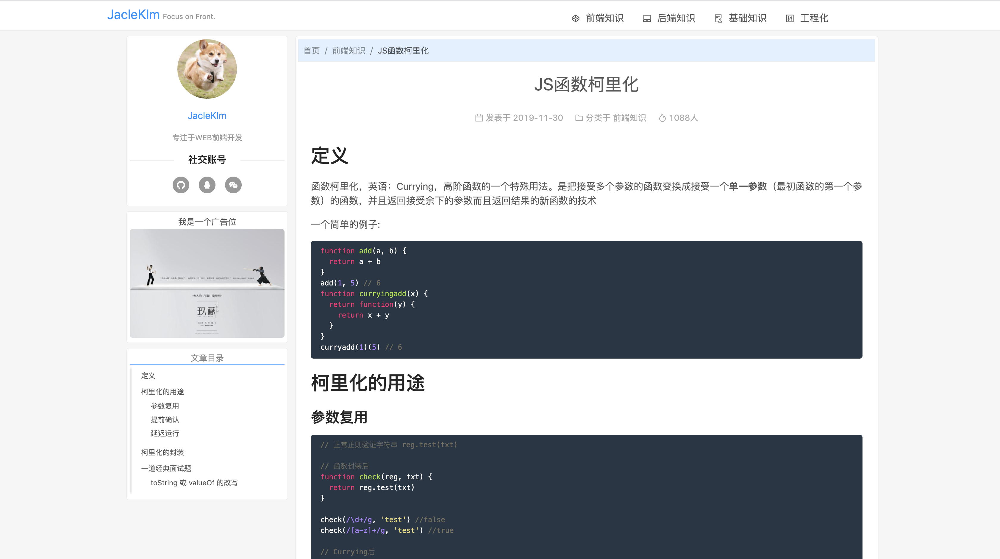

# react-blog
一个基于React + Egg.js + Antd 的博客前后端项目，博客系统的后台管理系统在[admin](https://github.com/Jacleklm/admin)。该博客目前部署在 JacleKlm.com，欢迎参观

## 项目截图
#### 博客首页和列表页（结构上是一样的）

#### 博客文章详情页


## 技术栈
* `Next.js`： 项目开发（本身就包含了React全家桶）
* `marked + highlight`：实现markdown语法的解析和显示
* `Ant Design`：项目UI组件
* `Egg.js`：项目的后端（数据中台）开发
* `Mysql`：数据库采用的是关系型数据库 MySQL，安装了官方带的 WorkBench 对数据库进行可视化管理

## 实现的功能
#### 首页
- [x] 显示文章
#### 列表页
- [x] 显示分类好的文章
#### 文章详情页
- [x] 实现markdown语法的解析和显示
- [x] 导航目录组件

## 项目优化计划
- [ ] markdown语法中图片的解析和存储
- [ ] 文章简介的实现
- [ ] 访问人数的实现。目前的访问人数是随机生成的

## 使用方法

``` bash
# 克隆到本地
git clone git@github.com:Jacleklm/react-blog.git

# 定位到该文件夹
cd react-blog

# 安装依赖
npm install

# 定位到数据中台文件夹，安装依赖
cd service
npm install
# 运行数据中台再运行前端项目。访问 http://localhost:3000 即可查看
# 在此之前还得搭建数据库并连接并写一些表给定初始值，就不细讲了...
npm run dev
cd ../
npm run dev
# 生成打包代码
npm run build
```
